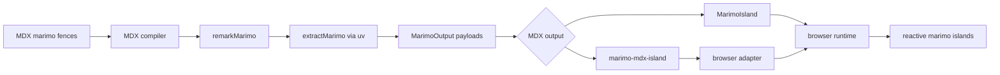

# mdx-marimo

`@marimo-team/mdx-marimo` renders marimo code fences inside MDX pages as interactive marimo islands.

````mdx
```python marimo
import marimo as mo

slider = mo.ui.slider(1, 10, label="items")
slider
```

```python marimo
mo.md(f"The slider is set to **{slider.value}**.")
```
````

## Pipeline



1. Author MDX with `python marimo`, `sql marimo`, or `markdown marimo` fences.
2. Register `marimoMdx()`, `marimoReactMdx()`, or `remarkMarimo` in the MDX compiler.
3. The remark plugin collects marimo fences, builds a `MarimoPageRequest`, and calls `extractMarimo`.
4. The extractor runs marimo through `uv`, returns one `MarimoOutput` payload per rendered cell, and caches extraction results under `.marimo-cache`.
5. The compiler replaces each fence with a `<marimo-mdx-island>` custom element or a framework component such as `MarimoIsland`.
6. The browser adapter mounts each island, loads the marimo assets, applies the theme bridge, and keeps dependent cells reactive.

Use `marimoMdx()` for custom element output in MDX hosts such as Astro and Vue. Use `marimoReactMdx()` for React, Next.js, and Docusaurus pages that import `@marimo-team/mdx-marimo/react`.

## Examples

- `examples/with-astro`: Astro MDX with custom element output.
- `examples/with-docusaurus`: Docusaurus docs pages with the React adapter.
- `examples/with-react`: Vite, React, `@mdx-js/react`, and the React adapter.
- `examples/with-vue`: Vite, Vue 3, `@mdx-js/vue`, and custom element output.
- `examples/with-next`: Next.js Pages Router MDX with the React adapter.
- `examples/with-nuxt`: Nuxt and Vue MDX with the Vue adapter.

## Workspace

```bash
pnpm install
pnpm build
pnpm lint
pnpm typecheck
pnpm test
pnpm format
```

The package source lives in `packages/mdx-marimo`. The docs app lives in `apps/docs`.
